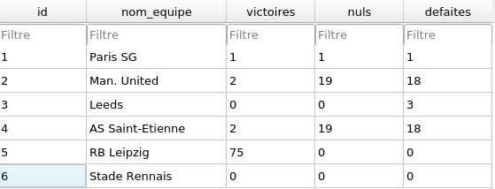
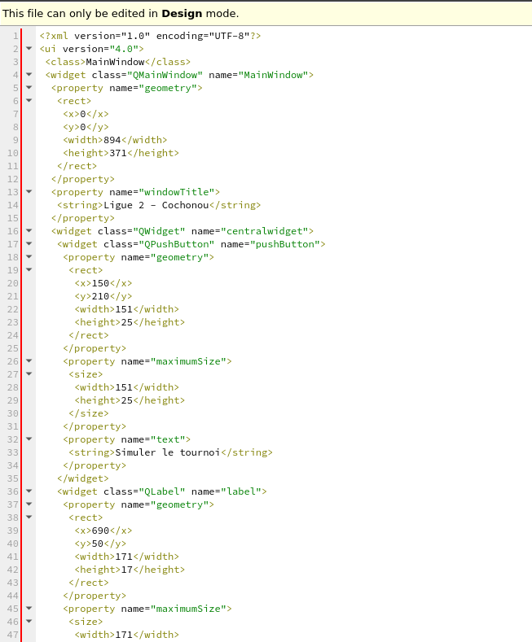
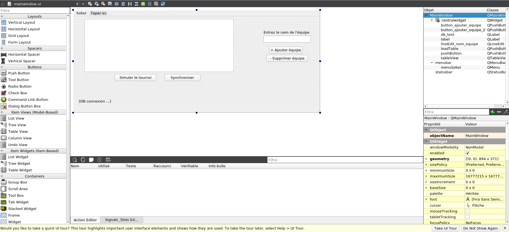

# Application de génération de tournoi de football - C++ / Qt

## 1. Technologies utilisées

### a. Base de données

- Utilisation d'une base de données SQLite
    - Simplicité d'utilisation    
    - Unique fichier ".db" ou ".sqlite"
    - Stockée en local directement dans le dossier du projet
    - Pas besoin d'hébergement ou de middleware pour y avoir accès de partout

### b. Design de l'appication

- Utilisation de QTCreator / QTDesigner
  - Génère un fichier ".ui"
  - Fichier .ui est un fichier XML, modifiable mais en dehors de QTCreator/QTDesigner
  
  
  
  - Système de "drag & drop"
  
  
  
  
  ## 2. Fonctionnement de l'application
  
  
  
  - En bas à gauche : *DB Connectée* --> la base de données est bien connectée
  - **Appuyer sur `Synchroniser` après chaque action**, le classement se mettra alors à jour
  - Pour afficher le tableau : `Synchroniser`
  - Pour ajouter une nouvelle équipe dans le classement : entrer le nom de l'équipe dans la zone de texte prévue à cet effet, puis `+ Ajouter équipe`
  - Pour supprimer une équipe du tournoi : entrer le nom de l'équipe (dans la même casse qu'affichée dans le classement) dans la zone de texte prévue à cet effet, puis `- Supprimer équipe`
  - Pour lancer le tournoi : `Simuler le tournoi` puis `Synchroniser`

  
  ## ⚠️ Problèmes rencontrés
  
  Faire attention au chemin de la base de données ! Si elle est la compilation est faite sur QTCreator, n'oubliez pas d'ajouter le fichier `teams.db` dans le répertoire `build-TournoiFoot-Desktop-Debug` ou indiquer le chemin absolu vers le fichier `teams.db` (ex. "/home/user/TournoiFoot/teams.db") --> *Remplacer `dir.absoluteFilePath("teams.db")` par le chemin absolu* . 
  
  Pour les autres IDE, il n'y a normalement aucun soucis de compilation.
  
  Ne pas oublier d'installer QSQLITE !
  
  `sudo apt-get update -y`  et `sudo apt-get install -y libqt5sql5-sqlite`
  
